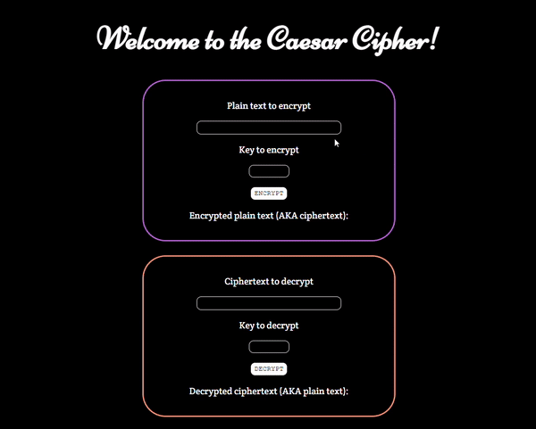

# Caesar Cipher
This Caesar Cipher was built in JavaScript during Execute Big's Tech Roulette Week 8. 

## Website: https://jbian92.github.io/Caesar-Cipher/ 

## Execute Big's Tech Roulette Week 8
- Learned about the basics of encryption and decryption as well as different ciphers (e.g. Caesar Cipher, Vigenere Cipher, etc.)
- Practiced using the Caesar Cipher to encrypt and decrypt messages
- Gained insight on basic hashing
